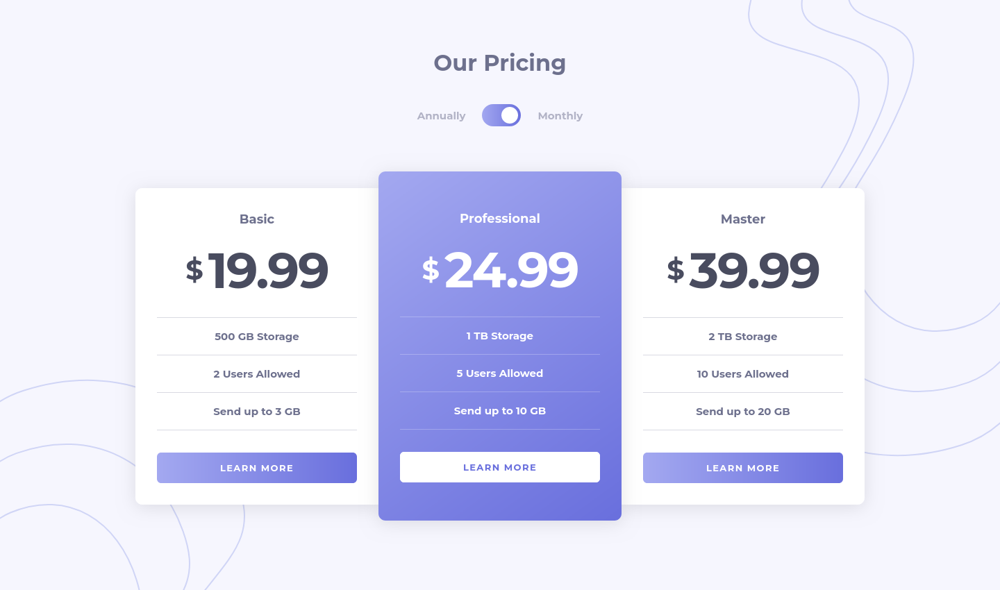
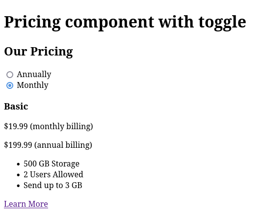
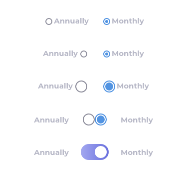

# Frontend Mentor - Pricing component with toggle solution

This is a solution to the [Pricing component with toggle challenge on Frontend Mentor](https://www.frontendmentor.io/challenges/pricing-component-with-toggle-8vPwRMIC). Frontend Mentor challenges help you improve your coding skills by building realistic projects.

## Table of contents

- [Overview](#overview)
  - [The challenge](#the-challenge)
  - [Screenshot](#screenshot)
  - [Links](#links)
- [My process](#my-process)
  - [Built with](#built-with)
  - [What I learned](#what-i-learned)
  - [Continued development](#continued-development)
  - [Useful resources](#useful-resources)
- [Author](#author)

## Overview

### The challenge

Users should be able to:

- [x] View the optimal layout for the component depending on their device's screen size
- [x] Control the toggle with both their mouse/trackpad and their keyboard
- [x] **Bonus**: Complete the challenge with just HTML and CSS

### Screenshot



### Links

- Solution URL: https://www.frontendmentor.io/solutions/pricing-component-with-accessible-toggle-built-with-html-and-css-GqqZUBT-5T
- Live Site URL: https://fem-pricing-10567.netlify.app/

## My process

### Built with

- HTML and CSS
- Mobile-first workflow
- ✨ Progressive enhancement ✨

### What I learned

Completing this challenge with just HTML and CSS is indeed possible. But I wanted to challenge myself even further by making it *accessible*, since "HTML and CSS only" solutions are often hacky workarounds that pay little consideration towards accessibility.

First, the HTML. In case the external stylesheet fails to load, the user can see both price tags for monthly and annual billing.



Later on I can add a `.visually-hidden` utility class to hide the extra phrases from sighted users, but still make them available to screen readers.

It might even be better to initially hide the price toggle component to better manage user expectations re: interactivity.

Then come the CSS. To implement the price toggle component, I moved the Annually and Monthly radio buttons so that they are placed on top of the toggle switch component.



To update the visible price tag based on the selected billing option, I used the `:has` pseudo-class and the subsequent-sibling selector `~` which both have good browser support in 2024.

```css
.price-toggle:has(#monthly:checked) ~ .price-cards .price-tags .annually,
.price-toggle:has(#annually:checked) ~ .price-cards .price-tags .monthly {
  display: none;
}
```

### Continued development

Since this is only a one-pager, I could use an internal stylesheet so that CSS styles are always loaded.

I could also sprinkle a little bit of JavaScript to enhance the toggle switch UX. For example, to add support for dragging the button from one option to another, or switching between the two states by pressing on the currently active option.

### Useful resources

- [Selection controls — UI component series | by Taras Bakusevych](https://uxdesign.cc/selection-controls-ui-component-series-3badc0bdb546)
- [Toggle Switch | Uxcel](https://app.uxcel.com/glossary/toggles)
- [Inclusively Hiding &amp; Styling Checkboxes and Radio Buttons – Sara Soueidan](https://www.sarasoueidan.com/blog/inclusively-hiding-and-styling-checkboxes-and-radio-buttons/)
- [The power of progressive enhancement - Andy Bell](https://archive.hankchizljaw.com/wrote/the-power-of-progressive-enhancement/)
- [git: fetch and merge, don&#8217;t pull &#8211; Mark&#039;s Blog](https://longair.net/blog/2009/04/16/git-fetch-and-merge/)

## Author

- Website - [Josh Javier](https://joshjavier.com/)
- Frontend Mentor - [@joshjavier](https://www.frontendmentor.io/profile/joshjavier)
